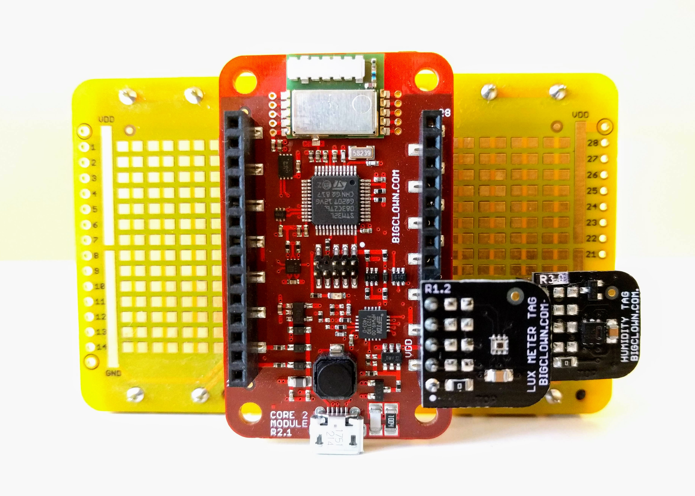

# Firmware for BigClown Thermometer

## Hardware

The following hardware components are used for this project:

* **[Humidity Tag](https://shop.bigclown.com/humidity-tag)**
* **[Lux Meter Tag](https://shop.bigclown.com/lux-meter-tag)**
* **[Core Module](https://shop.bigclown.com/core-module)**
* **[Battery Module](https://shop.bigclown.com/battery-module)**

## Boot Button

Press to force measure all values.
